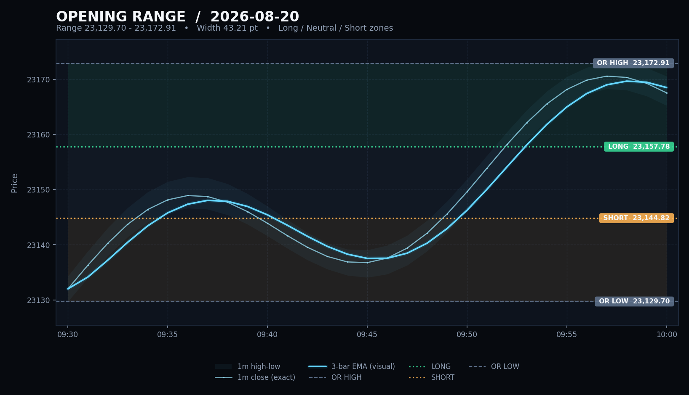
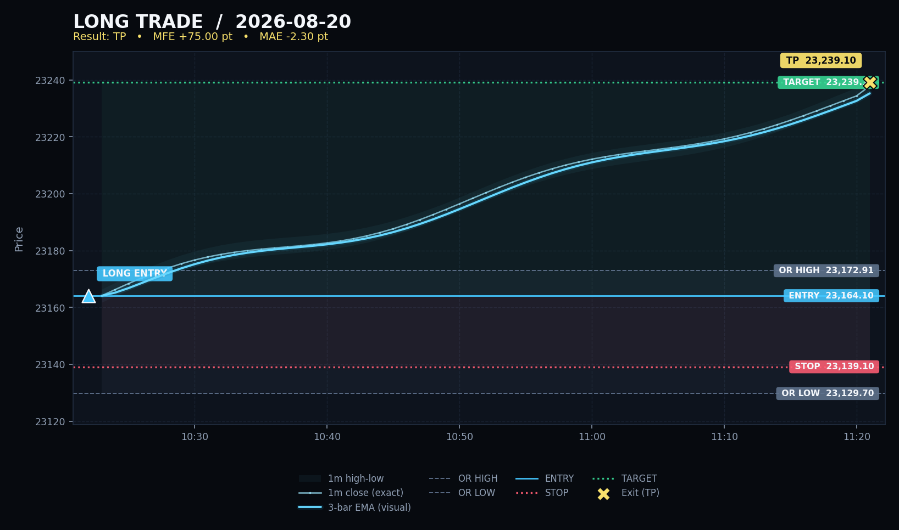
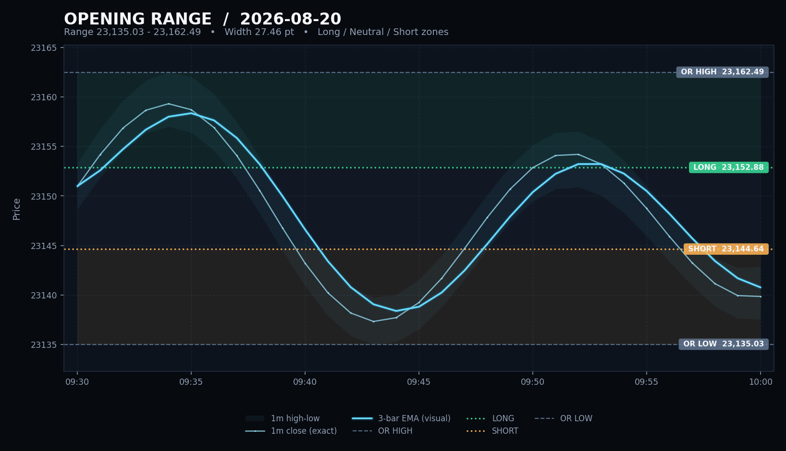

# X post flow examples

These illustrative examples are generated by `scripts/generate_example_assets.py` using the same formatters and chart functions as the bot.

## Use case 1: trade day — two posts

### Post 1: opening range and accepted paper trade

```text
NAS100_USD PAPER | 2026-08-20
Session 09:30-12:00 ET | Entry 10:22
OR 23,129.70-23,172.91
Long >= 23,157.78 | Short <= 23,144.82
LONG @ 23,164.10 | SL 23,139.10 | TP 23,239.10
Size 1.00 x $80.00/pt
Balance 100,000.00 USD | NAV 100,012.34
```

Attached chart:



### Post 2: exit and final recap

```text
NAS100_USD PAPER RECAP | 2026-08-20
LONG 23,164.10 -> 23,239.10 | TP
PnL +75.00 pt | +$6,000.00
MFE +75.00 | MAE -2.30 pt
Balance 100,000.00 -> 106,000.00 USD
NAV 100,012.34 -> 106,000.00
Sig 1 | Orders 1 | Skip 0 | Err 0
```

Attached chart:



## Use case 2: no-trade day — one post

```text
NAS100_USD PAPER RECAP | 2026-08-20
09:30-12:00 ET | Entry 10:22
OR 23,135.03-23,162.49
Long >= 23,152.88 | Short <= 23,144.64
No trade: entry stayed in the middle zone
Balance 100,000.00 -> 100,000.00 USD
NAV 100,012.34 -> 100,012.34
Sig 0 | Orders 0 | Skip 1 | Err 0
```

Attached chart:


